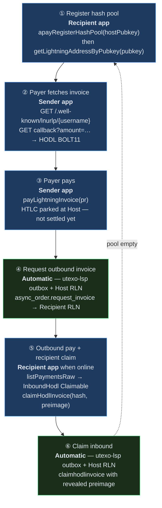
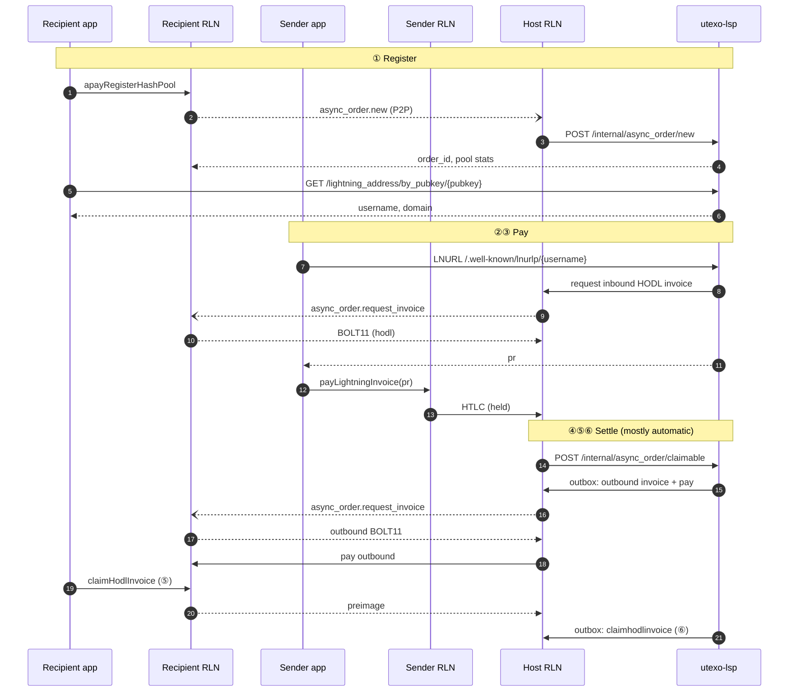

# Async Payments (APay)

Async payments let a recipient receive Lightning while **offline at payment time**. The recipient pre-registers a **hash pool** with an always-online **Host RLN** + **utexo-lsp**. Payers use a stable **Lightning Address** (`username@domain`); each payment gets a fresh HODL BOLT11.

**Protocol spec:** [Async Payments — RGB Lightning Node & Utexo LSP](https://hackmd.io/@xalkan/async-payments)

**Related docs:** [LSP implementation plan](./lsp-async-payments-implementation-plan.md) · [apay/new wire-format bugs](./bug-apay-new-invalid-request.md)

---

## Roles

| Role | Component | Your app calls it? |
|------|-----------|-------------------|
| Recipient | Recipient RLN on device | Yes — register pool, claim HODL |
| Host | LSP’s RLN node | No — P2P + HTTP to utexo-lsp |
| Orchestrator | utexo-lsp | Partial — LNURL + discovery HTTP only |
| Payer | Sender RLN on device | Yes — LNURL + pay invoice |

---

## Six-step flow (where you are)

Use the step numbers when debugging or reading demo logs (`async-pay` tab phases map to these steps).



| Step | What happens | Who drives it | SDK / HTTP |
|------|----------------|---------------|------------|
| **①** | Hash batch stored; Lightning Address minted for `peer_pubkey` | **Recipient app** | `wallet.apayRegisterHashPool(lspPeerPubkey)` then `lspClient.getLightningAddressByPubkey(recipientPubkey)` → `username@domain` |
| **②** | Next `hash_index` reserved; inbound HODL BOLT11 issued | **Sender app** | `wallet.payLightningAddress('user@domain', amtMsat)` or LNURL GETs on utexo-lsp |
| **③** | Payer pays BOLT11; inbound HTLC held (hodl) | **Sender app** | `wallet.payLightningInvoice({ lnInvoice })` — inside `payLightningAddress` or separate |
| **④** | LSP notified claimable; outbox asks Recipient for **outbound** HODL invoice | **Host + utexo-lsp** (no app code) | Recipient RLN must be **online** to answer P2P `async_order.request_invoice` |
| **⑤** | Host pays outbound invoice; Recipient claims → **preimage revealed** | **Recipient app** | `wallet.listPaymentsRaw()` → `InboundHodl` + `Claimable` → `wallet.claimHodlInvoice(paymentHash, preimage)` |
| **⑥** | Host claims inbound HTLC with preimage; payment complete | **Host + utexo-lsp** (no app code) | — |

**Blue steps (①②③⑤)** — your mobile app. **Green steps (④⑥)** — LSP cron/outbox and Host RLN; you only wait or keep Recipient RLN online for ④.

When `unused_hashes` hits zero, utexo-lsp marks the order **Exhausted** — run **①** again to refill.

---

## Sequence (control + payment legs)



---

## SDK entry points

**Recipient** (after RGB virtual channel to Host — set `enableVirtualChannelsV0: true` on both sides for regtest LSP):

```typescript
import { UTEXOWallet, UtexoLSPClient } from '@utexo/rgb-sdk-rn';

const lsp = new UtexoLSPClient({ baseUrl: 'http://127.0.0.1:8080' });

// ① Register + discover Lightning Address
await recipientWallet.apayRegisterHashPool(lspPeerPubkey);
const { username, domain } = await lsp.getLightningAddressByPubkey(recipientPubkey);
const address = `${username}@${domain}`;

// ⑤ Claim when back online
const payments = await recipientWallet.listPaymentsRaw();
const hodl = payments.find(
  (p) => p.paymentType === 'InboundHodl' && p.status === 'Claimable',
);
if (hodl?.preimage) {
  await recipientWallet.claimHodlInvoice(hodl.paymentHash, hodl.preimage);
}
```

**Sender:**

```typescript
// ②③ LNURL + pay (any host)
await senderWallet.payLightningAddress(address, 3_000_000);
```

**Not called from the app:** `POST /internal/async_order/*` — Host RLN uses those with utexo-lsp after P2P.

### API methods

| Method | Step | Description |
|--------|------|-------------|
| `apayRegisterHashPool(hostNodeId)` | ① | Register hash pool with Host RLN (LSP peer pubkey) |
| `UtexoLSPClient.getLightningAddressByPubkey(pubkey)` | ① | Resolve `username` + `domain` after registration |
| `payLightningAddress(address, amtMsat)` | ②③ | LNURL-pay discovery + pay |
| `payLightningInvoice({ lnInvoice })` | ③ | Pay HODL BOLT11 (also used inside `payLightningAddress`) |
| `listPaymentsRaw()` | ⑤ | Find `InboundHodl` + `Claimable` + `preimage` |
| `claimHodlInvoice(paymentHash, preimage)` | ⑤ | Reveal preimage; LSP settles inbound |
| `createHodlInvoice` / `cancelHodlInvoice` | — | HODL invoice helpers |

`UtexoLSPClient` also exposes `resolveAddress`, `onchainSend`, and `lightningReceive` for other LSP flows.

### utexo-lsp HTTP (public)

| Method | Path | Step |
|--------|------|------|
| GET | `/lightning_address/by_pubkey/{pubkey}` | ① — discovery after register |
| GET | `/.well-known/lnurlp/{username}` | ② — LNURL metadata |
| GET | `/pay/callback/{username}?amount=…` | ② — HODL BOLT11 (`asset_id` + `asset_amount` for RGB) |

---

## Demo tab mapping

| Demo phase | Flow step |
|------------|-----------|
| `b_init` … `b_channel` | Setup before ① |
| `register` | ① + `getLightningAddressByPubkey` |
| `a_init` … `a_channel` | Sender setup before ② |
| `lnurlp` | ② |
| `send` | ③ |
| `poll` / `claim` | ⑤ (④⑥ run in LSP while polling) |
| `done` | ⑥ complete |

**Regtest:** [rgb-sdk-rn-demo](https://github.com/UTEXO-Protocol/rgb-sdk-rn-demo) → **Async Payment** tab + `./scripts/start-lsp-regtest.sh`.

---

## Troubleshooting

- **Poll timeout / 0 payments at claim:** [bug-apay-claimable-outbox-stuck.md](./bug-apay-claimable-outbox-stuck.md)
- **`apay_new` / `InvalidRequest` on register:** [bug-apay-new-invalid-request.md](./bug-apay-new-invalid-request.md)
