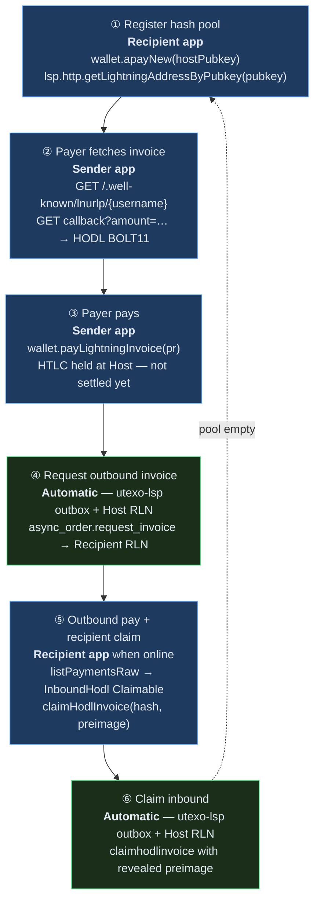
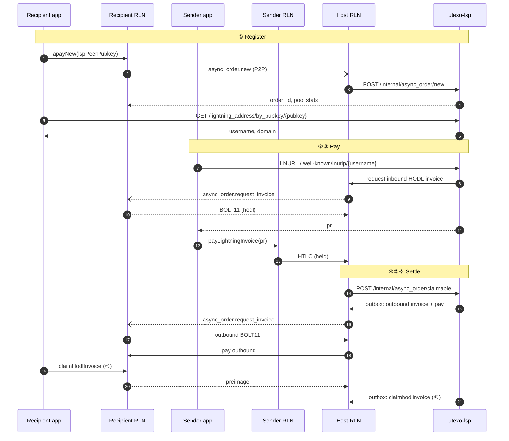

# Async Payments (APay)

Async payments let a recipient receive Lightning while **offline at payment time**. The recipient pre-registers a **hash pool** with an always-online **Host RLN** (LSP node). Payers use a stable **Lightning Address** (`username@domain`); each payment gets a fresh HODL BOLT11.

**Protocol spec:** [Async Payments — RGB Lightning Node & Utexo LSP](https://hackmd.io/@xalkan/async-payments)

---

## Roles

| Role | Component | Your app calls it? |
|------|-----------|-------------------|
| Recipient | Recipient RLN on device | Yes — register pool, claim HODL |
| Host | LSP's RLN node | No — P2P + HTTP to utexo-lsp |
| Orchestrator | utexo-lsp | Partial — LNURL + discovery HTTP only |
| Payer | Sender RLN on device | Yes — LNURL + pay invoice |

---

## Six-step flow



| Step | What happens | Who drives it | SDK call |
|------|-------------|---------------|----------|
| **①** | Hash batch stored; Lightning Address minted for `peer_pubkey` | **Recipient app** | `wallet.apayNew(lspPeerPubkey)` then `lsp.http.getLightningAddressByPubkey(pubkey)` |
| **②** | Next `hash_index` reserved; inbound HODL BOLT11 issued | **Sender app** | `lsp.http.resolveAddress(username, amtMsat, assetId?, assetAmount?)` |
| **③** | Payer pays BOLT11; inbound HTLC held | **Sender app** | `wallet.payLightningInvoice({ lnInvoice, assetId?, assetAmount? })` |
| **④** | LSP notified claimable; outbox asks Recipient for outbound HODL invoice | **Host + utexo-lsp** | Recipient RLN must be online to answer P2P |
| **⑤** | Host pays outbound invoice; Recipient claims → preimage revealed | **Recipient app** | `wallet.listPaymentsRaw()` → `claimHodlInvoice(hash, preimage)` |
| **⑥** | Host claims inbound HTLC with preimage; payment complete | **Host + utexo-lsp** | — |

**Blue steps (①②③⑤)** — your app. **Green steps (④⑥)** — LSP cron/outbox; you just keep the node online for ④.

When `unusedHashes` hits zero, utexo-lsp marks the order exhausted — call `apayNew` again to refill. `refillBatchSize` in the `ApayNewResponse` tells you how many hashes to include in each refill batch.

---

## Sequence diagram



---

## SDK usage

The recipient wallet must be constructed with `enableVirtualChannelsV0: true`. This is required for the LSP's 0-conf virtual channel offer — without it, the LSP's `FundingGenerationReady` event fails with `ChannelFundingType::Virtual requires a negotiated 0-conf channel`.

```typescript
import { UTEXOWallet, type LspPeer } from '@utexo/rgb-sdk-rn';

const wallet = new UTEXOWallet({
  ...nodeParams,
  lspBaseUrl:              'https://lsp-signet.utexo.com',
  lspBearerToken:          'bearer-token',
  enableVirtualChannelsV0: true,   // required for virtual 0-conf LSP channels
}, signer);

await wallet.init();
await wallet.unlock(unlockParams);

const LSP_PEER: LspPeer = {
  baseUrl:    'https://lsp-signet.utexo.com',
  peerPubkey: lspPeerPubkey,
  peerHost:   'lsp-signet.utexo.com',
  peerPort:   9735,
};
const lsp = await wallet.createLsp(LSP_PEER);
```

### ① Register + get Lightning Address

```typescript
// Connect to LSP peer first
await lsp.connect();

// Option A — one-shot helper (recommended): apayNew + getLightningAddressByPubkey
const { address } = await lsp.enableLightningAddress();
console.log(`Lightning Address: ${address}`);  // e.g. alice@lsp-signet.utexo.com

// Option B — manual: register pool separately, then fetch address
const pool = await wallet.apayNew(lspPeerPubkey);
console.log(`${pool.hashes.length} hashes issued, ${pool.unusedHashes} unused`);
const addr = await lsp.http.getLightningAddressByPubkey(walletPubkey);
console.log(`Lightning Address: ${addr.username}@${addr.domain}`);
```

`apayNew` returns an `ApayNewResponse`:

| Field | Description |
|-------|-------------|
| `orderId` | Persistent order ID — store it to track pool exhaustion |
| `unusedHashes` | How many hashes remain available for incoming payments |
| `refillBatchSize` | How many hashes to send when calling `apayNew` again to refill |
| `hashes` | `Array<{ hashIndex, paymentHash }>` — the hashes sent to the Host |

When `unusedHashes` approaches zero, call `apayNew` again with a new batch to refill the pool.

### ③ Sender pays (on the sender's device)

```typescript
// Step 1 — resolve the Lightning Address to a HODL BOLT11
// lsp.http.resolveAddress handles Android emulator host rewriting internally
const { pr } = await senderLsp.http.resolveAddress(
  username,        // e.g. 'alice'
  3_000_000,       // amtMsat
  ASSET_ID,        // RGB asset ID (pass undefined for sats-only)
  1,               // assetAmount (pass undefined for sats-only)
);

// Step 2 — pay the HODL invoice; LSP holds the HTLC until recipient claims
const payResult = await senderWallet.payLightningInvoice({
  lnInvoice:   pr,
  assetId:     ASSET_ID,    // optional — required for RGB asset payments
  assetAmount: 1,           // optional
});

// Or use the one-shot helper if you don't need to inspect the invoice:
const { invoice, sendResult } = await senderLsp.payAddress({
  address: 'alice@lsp-signet.utexo.com',
  amtMsat: 3_000_000,
  asset:   { assetId: ASSET_ID, assetAmount: 1 },  // omit for sats-only
});
```

### ⑤ Recipient comes online and claims

```typescript
await wallet.syncWallet();
const payments = await wallet.listPaymentsRaw();

// Manual loop
for (const p of payments) {
  if (p.paymentType !== 'InboundHodl' || p.status !== 'Claimable') continue;
  if (!p.preimage) continue;

  const result = await wallet.claimHodlInvoice(p.paymentHash, p.preimage);
  if (result.changed) console.log(`Claimed: ${p.amtMsat} msat`);
}

// Or use the one-shot helper — returns ClaimResult[] for each attempted claim:
const claimed = await lsp.claimPendingPayments();
// [{ paymentHash: '...', claimed: true }, { paymentHash: '...', claimed: false, error: '...' }]
```

`claimPendingPayments` filters for `Claimable` and `Claiming` statuses, attempts each claim, and never throws — failures are captured as `{ claimed: false, error }` entries.

### Cancelling a HODL invoice

If you want to reject a held payment (e.g. invoice expired or payment should not be accepted), cancel it before the LSP times out:

```typescript
const result = await wallet.cancelHodlInvoice(paymentHash);
// result.changed — true if the invoice state changed
```

Cancelling fails the inbound HTLC back to the sender. Use this when an `InboundHodl` payment arrives that you decide not to claim.

---

## API reference

| Method | Step | Returns | Description |
|--------|------|---------|-------------|
| `wallet.apayNew(hostNodeId)` | ① | `ApayNewResponse` | Register hash pool with Host RLN |
| `lsp.http.getLightningAddressByPubkey(pubkey)` | ① | `{ username, domain }` | Resolve Lightning Address after registration |
| `lsp.enableLightningAddress()` | ① | `LightningAddressInfo` | `apayNew` + `getLightningAddressByPubkey` in one call |
| `lsp.http.resolveAddress(username, amtMsat, assetId?, assetAmount?)` | ② | `{ pr: string }` | Fetch HODL BOLT11 from LSP LNURL callback |
| `lsp.payAddress({ address, amtMsat, asset? })` | ②③ | `{ invoice, sendResult }` | LNURL resolution + pay in one call |
| `wallet.payLightningInvoice({ lnInvoice, assetId?, assetAmount? })` | ③ | `LightningSendRequest` | Pay HODL BOLT11 directly |
| `wallet.listPaymentsRaw()` | ⑤ | `RlnPayment[]` | Find `InboundHodl` + `Claimable` + `preimage` |
| `wallet.claimHodlInvoice(paymentHash, preimage)` | ⑤ | `{ changed: boolean }` | Reveal preimage; LSP settles inbound HTLC |
| `wallet.cancelHodlInvoice(paymentHash)` | ⑤ | `{ changed: boolean }` | Fail inbound HTLC back to sender |
| `lsp.claimPendingPayments()` | ⑤ | `ClaimResult[]` | Filter + claim all claimable in one call |

**Not called from the app:** `POST /internal/async_order/*` — Host RLN uses those internally with utexo-lsp.

### `RlnPayment` fields (from `listPaymentsRaw`)

| Field | Type | Description |
|-------|------|-------------|
| `paymentHash` | `string` | Payment identifier |
| `paymentType` | `'Outbound' \| 'InboundAutoClaim' \| 'InboundHodl'` | `InboundHodl` = held |
| `status` | `'Pending' \| 'Claimable' \| 'Claiming' \| 'Succeeded' \| 'Cancelled' \| 'Failed'` | |
| `preimage` | `string?` | Present when `status === 'Claimable'` — pass to `claimHodlInvoice` |
| `amtMsat` | `number?` | Amount in millisatoshis |
| `assetId` | `string?` | RGB asset ID if RGB payment |
| `assetAmount` | `number?` | RGB asset amount |
| `payeePubkey` | `string` | Counterparty pubkey |
| `createdAt` | `number` | Unix timestamp (seconds) |

### `ClaimResult` (from `claimPendingPayments`)

| Field | Type | Description |
|-------|------|-------------|
| `paymentHash` | `string` | Payment hash that was attempted |
| `claimed` | `boolean` | `true` if `claimHodlInvoice` succeeded |
| `error` | `string?` | Error message if `claimed` is `false` |

---

## utexo-lsp public endpoints used

| Method | Path | Step |
|--------|------|------|
| GET | `/.well-known/lnurlp/{username}` | ② LNURL metadata |
| GET | `/pay/callback/{username}?amount=…&asset_id=…&asset_amount=…` | ② HODL BOLT11 |
| GET | `/lightning_address/by_pubkey/{pubkey}` | ① discovery after register |
