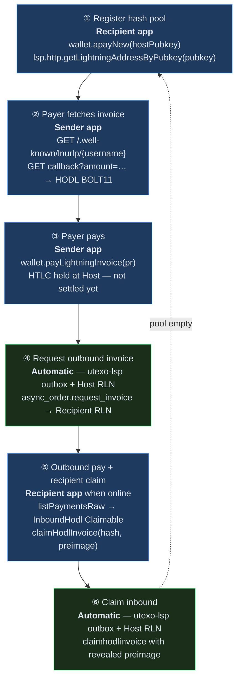
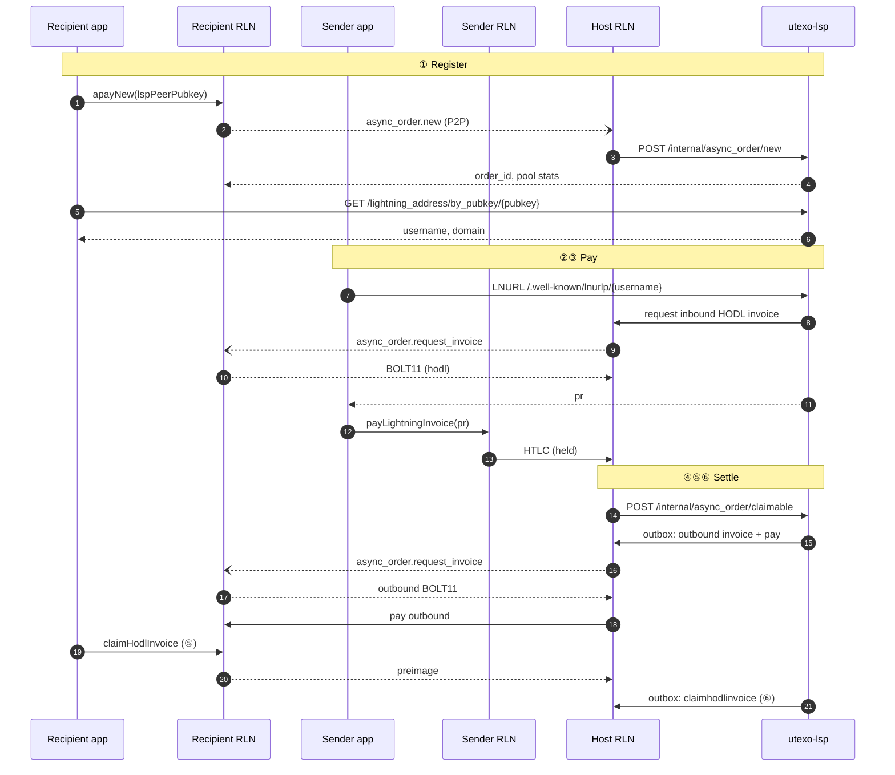

# Async Payments (APay)

Async payments let a recipient receive Lightning while **offline at payment time**. The recipient pre-registers a **hash pool** with an always-online **Host RLN** (LSP node). Payers use a stable **Lightning Address** (`username@domain`); each payment gets a fresh HODL BOLT11.

**Protocol spec:** [Async Payments — RGB Lightning Node & Utexo LSP](https://hackmd.io/@xalkan/async-payments)

---

## Roles

| Role | Component | Your app calls it? |
|------|-----------|-------------------|
| Recipient | Recipient RLN on device | Yes — register pool, claim HODL |
| Host | LSP's RLN node | No — P2P + HTTP to utexo-lsp |
| Orchestrator | utexo-lsp | Partial — LNURL + discovery HTTP only |
| Payer | Sender RLN on device | Yes — LNURL + pay invoice |

---

## Six-step flow



| Step | What happens | Who drives it | SDK call |
|------|-------------|---------------|----------|
| **①** | Hash batch stored; Lightning Address minted for `peer_pubkey` | **Recipient app** | `wallet.apayNew(lspPeerPubkey)` then `lsp.http.getLightningAddressByPubkey(pubkey)` |
| **②** | Next `hash_index` reserved; inbound HODL BOLT11 issued | **Sender app** | `lsp.payAddress(...)` or raw LNURL GETs |
| **③** | Payer pays BOLT11; inbound HTLC held | **Sender app** | `wallet.payLightningInvoice({ lnInvoice })` |
| **④** | LSP notified claimable; outbox asks Recipient for outbound HODL invoice | **Host + utexo-lsp** | Recipient RLN must be online to answer P2P |
| **⑤** | Host pays outbound invoice; Recipient claims → preimage revealed | **Recipient app** | `wallet.listPaymentsRaw()` → `claimHodlInvoice(hash, preimage)` |
| **⑥** | Host claims inbound HTLC with preimage; payment complete | **Host + utexo-lsp** | — |

**Blue steps (①②③⑤)** — your app. **Green steps (④⑥)** — LSP cron/outbox; you just keep the node online for ④.

When `unusedHashes` hits zero, utexo-lsp marks the order exhausted — call `apayNew` again to refill.

---

## Sequence diagram



---

## SDK usage

Recipient wallet must be constructed with `enableVirtualChannelsV0: true` (required for the LSP's 0-conf virtual channel offer):

```typescript
import { UTEXOWallet, type LspPeer } from '@utexo/rgb-sdk-rn';

const wallet = new UTEXOWallet({
  ...nodeParams,
  lspBaseUrl:              'https://lsp-signet.utexo.com',
  lspBearerToken:          'bearer-token',
  enableVirtualChannelsV0: true,
}, signer);

await wallet.init();
await wallet.unlock(unlockParams);

const LSP_PEER: LspPeer = {
  baseUrl:    'https://lsp-signet.utexo.com',
  peerPubkey: lspPeerPubkey,
  peerHost:   'lsp-signet.utexo.com',
  peerPort:   9735,
};
const lsp = await wallet.createLsp(LSP_PEER);
```

### ① Register + get Lightning Address

```typescript
// Connect to LSP peer first
await lsp.connect();

// Register hash pool — sends hashes to Host over P2P onion
const pool = await wallet.apayNew(lspPeerPubkey);
console.log(`${pool.hashes.length} hashes issued, ${pool.unusedHashes} unused`);

// Fetch the auto-generated Lightning Address for this wallet
const addr = await lsp.http.getLightningAddressByPubkey(walletPubkey);
console.log(`Lightning Address: ${addr.username}@${addr.domain}`);

// Or use the one-shot helper (combines both calls above):
const { address } = await lsp.enableLightningAddress();
console.log(`Lightning Address: ${address}`);
```

### ③ Sender pays (on the sender's device)

```typescript
// Option A — via UtexoLsp (handles LNURL resolution + pay)
await senderLsp.payAddress({
  address: 'alice@lsp-signet.utexo.com',
  amtMsat: 3_000_000,
  asset:   { assetId: ASSET_ID, assetAmount: 1 },
});

// Option B — manual (if you need to inspect the HODL invoice before paying)
const { pr } = await senderLsp.http.resolveAddress(username, 3_000_000, ASSET_ID, 1);
await senderWallet.payLightningInvoice({ lnInvoice: pr, assetId: ASSET_ID, assetAmount: 1 });
```

### ⑤ Recipient comes online and claims

```typescript
await wallet.syncWallet();
const payments = await wallet.listPaymentsRaw();

for (const p of payments) {
  if (p.paymentType !== 'InboundHodl' || p.status !== 'Claimable') continue;
  if (!p.preimage) continue;

  const result = await wallet.claimHodlInvoice(p.paymentHash, p.preimage);
  if (result.changed) console.log(`Claimed: ${p.amtMsat} msat`);
}

// Or use the one-shot helper:
const claimed = await lsp.claimPendingPayments();
```

---

## API reference

| Method | Step | Description |
|--------|------|-------------|
| `wallet.apayNew(hostNodeId)` | ① | Register hash pool with Host RLN |
| `lsp.http.getLightningAddressByPubkey(pubkey)` | ① | Resolve `username` + `domain` after registration |
| `lsp.enableLightningAddress()` | ① | `apayNew` + `getLightningAddressByPubkey` in one call |
| `senderLsp.payAddress({ address, amtMsat, asset? })` | ②③ | LNURL resolution + pay |
| `wallet.payLightningInvoice({ lnInvoice })` | ③ | Pay HODL BOLT11 directly |
| `wallet.listPaymentsRaw()` | ⑤ | Find `InboundHodl` + `Claimable` + `preimage` |
| `wallet.claimHodlInvoice(paymentHash, preimage)` | ⑤ | Reveal preimage; LSP settles inbound HTLC |
| `lsp.claimPendingPayments()` | ⑤ | Filter + claim all claimable in one call |

**Not called from the app:** `POST /internal/async_order/*` — Host RLN uses those internally with utexo-lsp.

---

## utexo-lsp public endpoints used

| Method | Path | Step |
|--------|------|------|
| GET | `/.well-known/lnurlp/{username}` | ② LNURL metadata |
| GET | `/pay/callback/{username}?amount=…&asset_id=…&asset_amount=…` | ② HODL BOLT11 |
| GET | `/lightning_address/by_pubkey/{pubkey}` | ① discovery after register |
