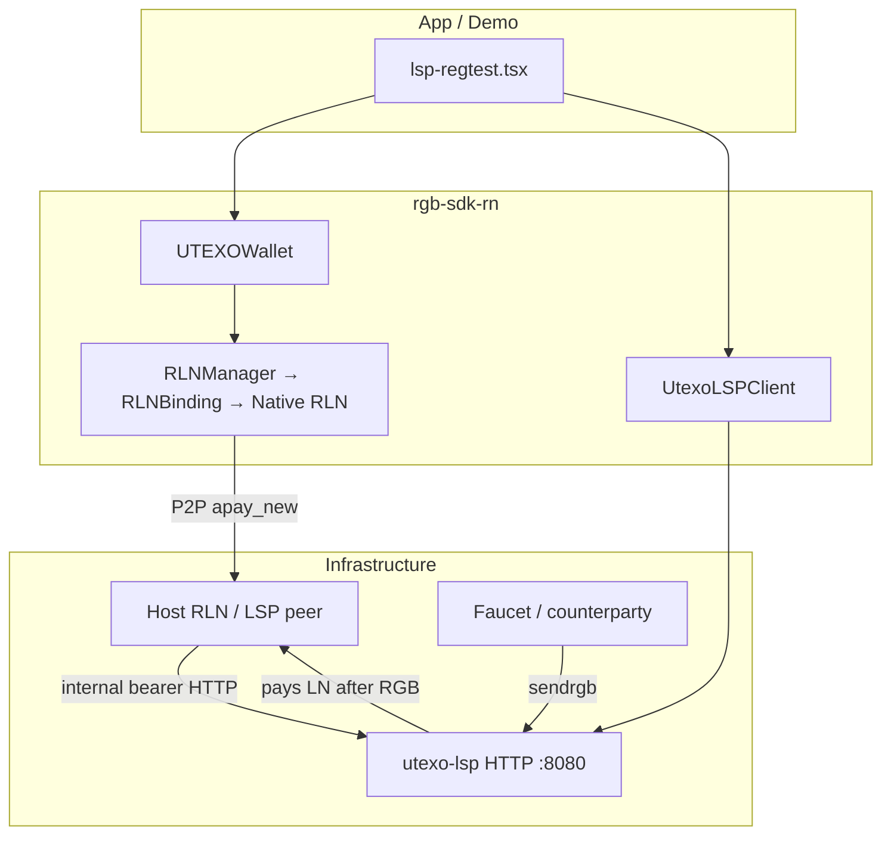

# LSP Architecture Analysis & Recommendations

> **Scope:** `UTEXOWallet`, `UtexoLSPClient`, native `lspBaseUrl` wiring, and demo usage in `rgb-sdk-rn-demo` (`lsp-regtest.tsx`, `lsp.tsx`, `async-pay.tsx`).  
> **Compared to:** Breez SDK (Greenlight — deprecated but still the reference LSP UX), Phoenix-style single-LSP apps, and typical LDK “node + separate LSP HTTP” stacks.

---

## 1. Executive summary

Your stack is **correctly split at the protocol level**: the mobile app talks to **utexo-lsp over HTTP** for bridge flows (`lightning_receive`, `onchain_send`, LNURL) and to **the LSP’s RLN node over P2P** for async payments (`apay_new` → Host RLN → `/internal/async_order/*`). That matches how production LSPs are built (orchestrator + always-online host node).

What is **not** yet at “Breez/Phoenix quality” is the **application-facing API**: integrators must stitch ~15 low-level calls, duplicate LNURL logic, and poll channel/RGB/LN state by hand — exactly what `lsp-regtest.tsx` does today (~750 lines for one e2e path).

**Recommendation:** keep `UTEXOWallet` as the **node + signer** surface; add a thin **`UtexoLspService`** (or `LspOrchestrator`) for **composed flows and polling**; wire **constructor `lspBaseUrl`** into a default HTTP client; shrink demo screens to call **one high-level method per user journey**.

---

## 2. How popular Lightning SDKs treat the LSP

| Pattern | Breez SDK (Greenlight) | Phoenix / “single LSP” wallets | Your SDK today |
|--------|-------------------------|--------------------------------|----------------|
| **Who opens channels?** | LSP after `connect_lsp`; fees via LSP2 | Automatic on first receive | LSP cron after `connectPeer` (demo polls manually) |
| **LSP discovery** | `list_lsps()`, `lsp_info()`, default from API key | Fixed LSP baked in | `UtexoLSPClient.getInfo()` + env URL |
| **Receive UX** | `receive_payment()` hides invoice + liquidity | One tap receive | `createLightningInvoice` + `lightningReceive` + RGB send + poll |
| **Send UX** | `send_payment()` / LNURL built-in | Built-in | `payLightningInvoice` / `payLightningAddress` |
| **Config** | API key → default LSP | None (vendor LSP) | `lspBaseUrl` on **node** + separate **HTTP client** |
| **Offline receive** | N/A (online node) | N/A | **Async payments** (hash pool + HODL) — unique strength |

**Takeaway:** Breez optimizes for **“call one SDK method; we handle LSP + channel + invoice.”** Your primitives are **complete** but **orchestration lives in the app** (demo), which is fine for power users but harsh for product teams.

---

## 3. Current architecture (rgb-sdk-rn)

### 3.1 Layer diagram



### 3.2 Three LSP integration planes (do not merge mentally)

| Plane | Config / entry | Used for |
|-------|----------------|----------|
| **A. Native node** | `UTEXOWalletNodeParams.lspBaseUrl`, `lspBearerToken` → `rlnCreateNode` | Host RLN calls utexo-lsp **internally** during async payments |
| **B. HTTP client** | `UtexoLSPClient({ baseUrl, bearerToken? })` | `lightning_receive`, `onchain_send`, LNURL, `getLightningAddressByPubkey` |
| **C. Wallet shortcuts** | Methods on `UTEXOWallet` | `requestLspRgbDeposit`, `payRgbViaLsp`, `payLightningAddress`, `apayRegisterHashPool` |

Plane **A** and **B** use the **same URL** in production but **different code paths**. Apps must set **both** when using async payments *and* bridge flows.

### 3.3 What `UTEXOWallet` already does well

- **Lifecycle** is clear: `init` → `unlock` → operations → `shutdown` / `destroy`.
- **LSP bridge helpers** exist and are coherent:
  - `requestLspRgbDeposit` — Lightning → RGB (matches `POST /lightning_receive`).
  - `payRgbViaLsp` — RGB → Lightning (`onchain_send` + `payLightningInvoice`).
  - `apayRegisterHashPool` + `claimHodlInvoice` — async/offline receive path.
- **`UtexoLSPClient`** is RN-free and ready to move to `@utexo/rgb-sdk-core`.
- **Type mapping** from `Rln*` to core types is centralized in one class.

### 3.4 Gaps vs. a “product-grade” LSP API

| Gap | Impact on `lsp-regtest.tsx` |
|-----|-----------------------------|
| No **default LSP client** from `lspBaseUrl` | Constructs `UtexoLSPClient` separately; User A regtest wallet omits `lspBaseUrl` on `init` |
| No **channel readiness** helper | ~40 lines × 2 users polling `listChannels` + mining |
| No **end-to-end `lightning_receive` waiter** | Manual RGB transfer poll + `getLightningReceiveRequest` |
| **`payLightningAddress` duplicates** `UtexoLSPClient.resolveAddress` | Raw `fetch` in wallet; async-pay uses `lspClient` correctly |
| **Status vocabulary** | Demo accepts `Succeeded` \| `Settled`; SDK maps to core `TransferStatus` — easy to drift |
| **Two pubkeys** | `getInfo().pubkey` (HTTP) vs LSP **peer** pubkey from `:3005/nodeinfo` — demo documents both but easy to confuse |
| **God-class growth** | Every new LSP flow adds methods to `UTEXOWallet` instead of a dedicated service |

---

## 4. Analysis of demo flows

### 4.1 `lsp-regtest.tsx` (regtest e2e)

**What it implements:** `run_lightning_receive_flow` from utexo-lsp e2e + Part 2 P2P pay — faithful and valuable as a **protocol test harness**.

**Current call pattern (Part 1 — simplified):**

1. `new UtexoLSPClient` + `getInfo`
2. `new UTEXOWallet` (**without** `lspBaseUrl` on User A)
3. Fund, UTXOs, `connectPeer(lspPeerUri)`, mine, poll RGB channel
4. Repeat for User B (required — matches Python conftest)
5. `createLightningInvoice` → `lsp.lightningReceive` (manual)
6. Faucet `sendrgb` via **daemon HTTP** (not SDK)
7. Poll transfers on daemons + `getLightningReceiveRequest`

**Issues / improvement opportunities:**

| # | Observation | Suggested change |
|---|-------------|------------------|
| 1 | Steps 5–7 are exactly `requestLspRgbDeposit` + a settlement waiter | Replace 5 with `await wA.requestLspRgbDeposit({ lsp, rgb: { assetId: ASSET_ID }, lnInvoiceRequest: { amountSats: PAYMENT_MSAT/1000 } })` |
| 2 | Faucet is external by design in e2e | Keep for regtest; add optional `watchLspRgbDeposit({ mappingId })` when LSP exposes status API |
| 3 | ~200 lines of duplicate polling | Move to `utils/lsp-flow.ts`: `waitForRgbChannel(wallet, assetId)`, `waitForLightningReceiveSettled(wallet, invoice)` |
| 4 | `LSP_PEER_PUBKEY` fetched at runtime — good | Also expose `lsp.getInfo()` pubkey vs peer pubkey in UI labels (“HTTP node” vs “P2P peer”) |
| 5 | Part 2 reimplements liquidity wait | `waitForOutboundMsat(wallet, lspPeerPubkey, minMsat)` helper |
| 6 | Module creates new `UtexoLSPClient` per run | Fine; could use singleton like `async-pay.tsx` for consistency |

### 4.2 `lsp.tsx` (signet)

Closer to a **real app**: Node B issues asset, Node A receives via LSP, Node B `onchainSend`s RGB.

**Improvements:**

- Use `requestLspRgbDeposit` instead of split `createLightningInvoice` + `lightningReceive`.
- Node A wallet already sets `lspBaseUrl: LSP_URL` — good; also pass `lspBearerToken` if signet requires it.
- Add `connectPeer` + channel wait (signet comment says “cron 30s”) — today settlement often fails without channel; a shared `ensureLspRgbChannel` would match regtest rigor.

### 4.3 `async-pay.tsx` (best LSP HTTP usage)

This tab **already follows recommended patterns**:

- Module-level `UtexoLSPClient`
- `apayRegisterHashPool` + `getLightningAddressByPubkey`
- LNURL via LSP client (not raw fetch)

Use it as the **template** for refactoring `lsp-regtest.tsx` HTTP/LNURL pieces.

---

## 5. Recommended target architecture

### 5.1 Split responsibilities (avoid growing `UTEXOWallet`)

```
┌─────────────────────────────────────────────────────────────┐
│  UTEXOWallet          — IWalletManager + IUTEXOProtocol      │
│    RLN lifecycle, RGB, LN primitives, apay/HODL on node      │
└─────────────────────────────────────────────────────────────┘
                              │
                              │ uses
                              ▼
┌─────────────────────────────────────────────────────────────┐
│  UtexoLspService      — NEW (pure TS, → rgb-sdk-core)        │
│    - default client from wallet.getLspConfig()               │
│    - ensurePeerConnected(peerUri)                            │
│    - waitForRgbChannel({ assetId, timeout })                 │
│    - lightningReceiveDeposit()  // wraps requestLspRgbDeposit│
│    - watchLightningReceiveSettled(invoice)                   │
│    - payLightningAddress()      // delegate to UtexoLSPClient│
│    - registerAsyncLightningAddress(hostPubkey)               │
└─────────────────────────────────────────────────────────────┘
                              │
                              ▼
┌─────────────────────────────────────────────────────────────┐
│  UtexoLSPClient       — HTTP to utexo-lsp (existing)         │
└─────────────────────────────────────────────────────────────┘
```

`UtexoLspService` constructor: `(wallet: UTEXOWallet, config: LspServiceConfig)` where config includes `baseUrl`, `bearerToken?`, `peerPubkey`, `peerHost`, `peerPort`, `assetId?`.

### 5.2 Minimal API additions on `UTEXOWallet`

Keep the class focused; only add **wiring**, not more orchestration:

```typescript
// Proposed — small surface
getLspConfig(): { baseUrl: string | null; bearerToken: string | null };
createLspService(peer: { pubkey: string; host: string; port: number }): UtexoLspService;
```

Deprecate directionally: inline `payLightningAddress` raw fetch → implement via `UtexoLSPClient.resolveAddress` + `payLightningInvoice`.

### 5.3 High-level flows to expose (maps to Breez-style ergonomics)

| User journey | Proposed method | Internal steps |
|--------------|-----------------|----------------|
| **Receive RGB via LN** (lightning_receive) | `lspService.receiveRgbOverLightning({ assetId, amountSats, amountRgb })` | `requestLspRgbDeposit` → return `{ rgbInvoice, mappingId }` → optional `watchUntilLnPaid` |
| **Send RGB to LN recipient** | `lspService.sendRgbToLightning({ rgbInvoice, ln: {...} })` | `payRgbViaLsp` |
| **Pay Lightning Address** | `lspService.payAddress(address, amtMsat, asset?)` | `resolveAddress` + `payLightningInvoice` |
| **Offline receive setup** | `lspService.enableLightningAddress(hostPubkey)` | `apayRegisterHashPool` + `getLightningAddressByPubkey` |
| **Come online & claim** | `lspService.claimPendingAsyncPayments()` | `listPaymentsRaw` filter `InboundHodl` + `claimHodlInvoice` |

Polling options: `AbortSignal`, `onProgress`, `pollIntervalMs` — same ergonomics as e2e `wait_until` in Python.

### 5.4 Native `lspBaseUrl` alignment

**Rule for integrators:**

| Feature | Required config |
|---------|-----------------|
| `lightning_receive` / `onchain_send` only | HTTP `UtexoLSPClient` + peer connect for channels |
| Async Lightning Address | `lspBaseUrl` + `lspBearerToken` on **wallet init** **and** HTTP client for discovery |
| Custom LSP | Inject `IUtexoLSPClient` mock in tests |

Document in README: **`lspBaseUrl` on node ≠ optional if you use async payments** — it enables Host RLN → utexo-lsp internal API.

### 5.5 Errors & observability

- Re-export **`LspError`** with stable `code` enum (`HTTP`, `TIMEOUT`, `LNURL`, `CHANNEL_NOT_READY`).
- Add **`LspFlowError`** wrapping step name (`channel_wait`, `rgb_settle`, `ln_settle`) for UI messages.
- Optional: `mappingId` on `lightning_receive` for future LSP status webhook/poll endpoint.

---

## 6. Concrete demo refactor (lsp-regtest.tsx)

### 6.1 Before (conceptual)

```typescript
const inv = await wA.createLightningInvoice({ ... });
const lr = await lsp.lightningReceive({ lnInvoice: inv.lnInvoice, rgb: { assetId } });
// ... 80 lines polling ...
const status = await wA.getLightningReceiveRequest(aInvoice);
```

### 6.2 After (using SDK + shared utils)

```typescript
// wallet init
new UTEXOWallet({
  ...nodeParams,
  lspBaseUrl: LSP_URL,
  lspBearerToken: process.env.EXPO_PUBLIC_LSP_BEARER_TOKEN ?? null,
  enableVirtualChannelsV0: true, // if async tab shares stack
}, signer);

const lspService = wA.createLspService({
  pubkey: LSP_PEER_PUBKEY,
  host: _host,
  port: LSP_LDK_PORT,
});

await lspService.ensureRgbChannel(ASSET_ID, { timeoutMs: 120_000 });

const { rgbInvoice, mappingId } = await lspService.receiveRgbOverLightning({
  assetId: ASSET_ID,
  amountSats: PAYMENT_MSAT / 1000,
  amountRgb: PAYMENT_ASSET_AMOUNT,
});

// Faucet still pays rgbInvoice (e2e-specific)
await faucetSendRgb(rgbInvoice, ...);

await lspService.waitLightningReceiveSettled(inv.lnInvoice, { timeoutMs: 60_000 });
```

Part 2:

```typescript
await lspService.waitOutboundLiquidity(PAYMENT_MSAT);
await wA.payLightningInvoice({ lnInvoice: bInvoice });
await lspService.waitLightningReceiveSettled(bInvoice, { on: wB });
```

### 6.3 File layout suggestion (demo repo)

```
rgb-sdk-rn-demo/
  utils/
    lsp-regtest-config.ts   # host, URLs, ASSET_ID
    lsp-channel.ts          # waitForRgbChannel, waitForOutboundMsat
    lsp-settlement.ts       # waitRgbTransferSettled, waitLnInvoiceSettled
  app/(tabs)/lsp-regtest.tsx  # thin orchestration + UI only
```

---

## 7. Priority roadmap

| Priority | Item | Effort | Value |
|----------|------|--------|-------|
| P0 | Document dual-plane LSP config (native URL + HTTP client + peer pubkey) | S | Prevents production misconfig |
| P0 | Fix `payLightningAddress` to use `UtexoLSPClient.resolveAddress` | S | One LNURL implementation |
| P1 | Add `UtexoLspService` with channel + settlement waiters | M | Cuts demo/integration code 50%+ |
| P1 | `wallet.createLspService()` + pass `lspBaseUrl` in regtest demo | S | Consistency |
| P2 | `claimPendingAsyncPayments()` helper | M | Better offline-receive UX |
| P2 | Move `UtexoLSPClient` + service to `@utexo/rgb-sdk-core` | M | Web/mobile parity |
| P3 | LSP2-style fee quote types (if utexo-lsp adds fee endpoints) | L | Parity with Breez Greenlight |

---

## 8. Mental model for integrators

**Think in journeys, not endpoints:**

1. **“I want to receive RGB when someone pays Lightning”**  
   → channel to LSP → `requestLspRgbDeposit` → share `rgbInvoice` → wait LN invoice settled.

2. **“I want to pay a Lightning Address (maybe while offline)”**  
   → sender: `payLightningAddress` / LNURL → recipient later: `claimHodlInvoice`.

3. **“I want to cash out RGB to a Lightning invoice”**  
   → `payRgbViaLsp`.

4. **“I want Breez-like defaults”**  
   → construct `UtexoLspService` once at app start with your LSP’s peer URI + `lspBaseUrl`; call composed methods; let service poll.

`UTEXOWallet` should remain the **Bitcoin/RGB/LN node**. The LSP is a **liquidity and bridge partner** — expose it as a **service object**, not as fifteen methods sprinkled across wallet and demo code.

---

## 9. References in this repo

- [async-payments.md](./async-payments.md) — async payment steps ①–⑥  
- [lsp-async-payments-implementation-plan.md](./lsp-async-payments-implementation-plan.md) — native vs HTTP split  
- Demo: `rgb-sdk-rn-demo/app/(tabs)/lsp-regtest.tsx`, `lsp.tsx`, `async-pay.tsx`  
- SDK: `src/wallet/utexo-wallet.ts`, `src/lsp/UtexoLSPClient.ts`
