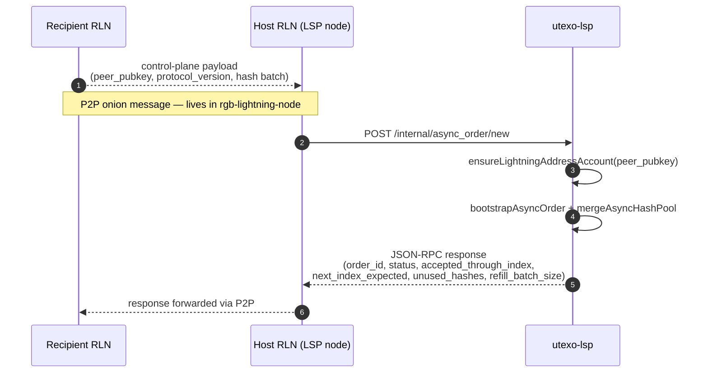
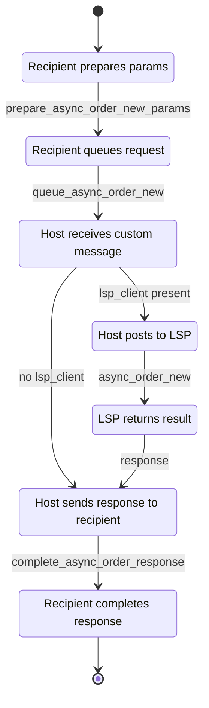

# LSP + Async Payment — Implementation Plan

> Branch: `feat/async_payment` · Date: 2026-05-28  
> Repositories analysed: `rgb-lightning-node` (Rust/UniFFI), `rgb-sdk-rn` (RN SDK), `rgb-sdk-core` (shared core), `rgb-sdk-web` (Web SDK), `utexo-lsp` (Go LSP bridge), `wdk-rgb-lightning` branch `feat/lsp-client`

> **Architecture decision (2026-05-28):** `UtexoLSPClient` will live in `rgb-sdk-rn` for this release. It must be written as if it already belongs in `@utexo/rgb-sdk-core` — zero React Native dependencies, pure `fetch` only — so that moving it next release is a file-move with an import-path update, not a refactor.

---

## 1. Current State of LSP / Async Payment Support

### 1.1 What already works in `rgb-lightning-node` (RLN daemon)

| Capability | UDL / OpenAPI | Notes |
|---|---|---|
| HODL invoice creation | `LnInvoiceRequest.payment_hash?` | Custom payment hash, UDL line 510 |
| `min_final_cltv_expiry_delta` on invoice | `LnInvoiceRequest.min_final_cltv_expiry_delta?: u16` | UDL line 512 |
| HODL invoice cancel | `cancelhodlinvoice(CancelHodlInvoiceRequest)` | UDL line 112 |
| HODL invoice claim | `claimhodlinvoice(ClaimHodlInvoiceRequest)` | UDL line 114; returns `ClaimHodlInvoiceResponse { changed: bool }` |
| `InboundHodl` payment type | `PaymentType` enum | Tracked alongside `Outbound`, `InboundAutoClaim` |
| LSP config in init | `SdkInitRequest.lsp_base_url?` + `lsp_bearer_token?` | UDL lines 551-552 |
| Async order — sender | `POST /apay/new` | Derives deterministic hashes, sends `async_order.new` JSON-RPC to LSP peer via P2P onion messages |
| Async order — recipient | `POST /apay/outboundinvoice` | LSP calls this; recipient returns a HODL invoice for the LSP to pay |
| `decoded_ln_invoice` includes CLTV | `DecodeLnInvoiceResponse.min_final_cltv_expiry_delta: u64` | UDL line 441 |

The async payment logic lives in `src/async_order.rs`. It communicates with the LSP via `AsyncOrderLspClient` (P2P onion messaging), **not** via direct HTTP from the mobile device.

### 1.2 Implementation status in `rgb-sdk-rn` (updated 2026-06-01, v0.5.0-beta.1)

| Feature | Status | Location |
|---|---|---|
| `lspBaseUrl` / `lspBearerToken` in node init | ✅ Done | `UTEXOWallet` params → `RLNBinding.rlnCreateNode` |
| `paymentHash?` in `rlnLnInvoice()` | ✅ Done | `RLNBinding`, `NativeRgb`, `RgbModule.kt`, `RgbSwiftHelper.swift` |
| `minFinalCltvExpiryDelta?` in `rlnLnInvoice()` | ✅ Done | same |
| `rlnClaimHodlInvoice()` | ✅ Done | `RLNBinding`, bridge, `UTEXOWallet.claimHodlInvoice` |
| `rlnCancelHodlInvoice()` | ✅ Done | `RLNBinding`, bridge, `UTEXOWallet.cancelHodlInvoice` |
| `rlnApayNew()` | ✅ Done | `RLNBinding`, `RgbModule.kt`, `RgbSwiftHelper.swift` |
| `UTEXOWallet.apayRegisterHashPool` | ✅ Done | `utexo-wallet.ts` |
| `UTEXOWallet.listPaymentsRaw()` | ✅ Done | `utexo-wallet.ts` — returns full `RlnPayment[]` with `preimage` |
| `UTEXOWallet.createHodlInvoice` | ✅ Done | `utexo-wallet.ts` |
| `UtexoLSPClient` | ✅ Done | `src/lsp/UtexoLSPClient.ts` |
| `UTEXOWallet.payLightningAddress` | ✅ Done | `utexo-wallet.ts` |

### 1.3 State in other SDKs

| SDK | HODL invoices | `min_final_cltv_expiry_delta` | LSP client | Async payments |
|---|---|---|---|---|
| `rgb-sdk-web` | ✓ (`createHodlLnInvoice`, `claimHodlInvoice`, `cancelHodlInvoice`) | ✗ | `LspClient` class on `feat/lsp-client` branch | ✗ (needs `/apay/new` + `/apay/outboundinvoice`) |
| `rgb-sdk-rn` | ✅ | ✅ | ✅ | ✅ (v0.5.0-beta.1) |
| `rgb-sdk-core` | ✗ (no types yet) | ✗ | ✗ | ✗ |

### 1.4 `utexo-lsp` (Go bridge)

A standalone Go service wrapping an RLN node. Key public endpoints:

| Method | Path | Purpose |
|---|---|---|
| GET | `/.well-known/lnurlp/{username}` | LUD-06 Lightning Address discovery |
| GET | `/pay/callback/{username}?amount=<msat>` | Returns HODL BOLT11 to sender |
| POST | `/onchain_send` | Caller submits RGB invoice; LSP issues LN invoice; on payment it does `sendrgb` |
| POST | `/lightning_receive` | Caller submits LN invoice; LSP issues RGB invoice; on RGB settlement it pays the LN invoice |
| GET | `/get_info` | LSP node pubkey + channel info |

Internal JSON-RPC endpoints (bearer-token protected, called from RLN `async_order.rs`):

| Path | Purpose |
|---|---|
| `POST /internal/async_order/new` | Register hash pool (max 200 hashes per batch) |
| `POST /internal/async_order/claimable` | Mark invoice claimable after sender pays |
| `POST /internal/async_order/payment_sent` | Confirm outbound payment delivered |

CLTV policy: `144 blocks` inbound (LSP creates invoice), `18 blocks` outbound (LSP requests from recipient), `12 blocks` safety margin before refusing.

---

## 2. Async Payment Flow

### 2.1 Hash Pool Registration (Recipient → LSP)

The control plane for hash registration lives entirely inside `rgb-lightning-node`. The mobile SDK calls a single method; all P2P and HTTP communication happens inside the native daemon.



**SDK call:** `wallet.apayRegisterHashPool(hostNodePubkey)` — `hostNodePubkey` is the **LDK peer pubkey of the LSP's RLN node** (not the utexo-lsp HTTP service). After this call the LSP has created a Lightning Address for the recipient keyed by `peer_pubkey`.

### 2.2 Recipient State Machine (inside `rgb-lightning-node`)



### 2.3 Full End-to-End Payment Flow

```
Recipient RLN          Host RLN (LSP)          utexo-lsp               Sender RLN
──────────────────────────────────────────────────────────────────────────────────
1. apay_new ──P2P──► /internal/async_order/new ──► ensureLightningAddressAccount
   (hash batch)       (stores pool, creates          (creates LN Address for
                       LN Address for recipient)      recipient keyed by pubkey)
   ◄── order_id, status, accepted_through_index ─────────────────────────────────

2.                                              ◄── GET /.well-known/lnurlp/{pubkey}
                                                     (sender discovers recipient LN Address)

3.                    GET /pay/callback/
                       ?amount=<msat> ─────────────────────────────────────────────►
                      (reserves hash slot,
                       creates HODL BOLT11
                       with hash from pool,
                       min_final_cltv=144)
                      ◄─────────────────────────────────────── (BOLT11 returned to sender)

4.                    ◄── sender pays BOLT11
                       (HTLC held at LSP —
                        NOT yet settled;
                        recipient is "offline")

5. /apay/outboundinvoice ◄── /internal/async_order/claimable
   LSP requests HODL invoice   (LSP notifies recipient RLN
   with payment_hash +          via P2P onion message;
   min_final_cltv=18            recipient RLN creates HODL
                                invoice, returns to LSP)

6.                    LSP pays recipient HODL invoice ──────────────────────────────►
                       (sendpayment to recipient node)

7. claimHodlInvoice(preimage) ──────────────────────────────────────────────────────►
   (recipient reveals preimage;  (LSP receives preimage,
    payment_type=InboundHodl      settles inbound HTLC
    status→Succeeded)             from sender)
```

### 2.4 Key protocol invariants

- Payment hashes are derived **deterministically** from the recipient's wallet seed by RLN inside `apay_new`. No client-side hash generation required.
- `hostNodePubkey` in `apayRegisterHashPool` is the **LDK peer pubkey** of the LSP's RLN node — not the utexo-lsp HTTP URL.
- The LSP holds the HTLC until the outbound payment to the recipient settles — never settles early.
- `claim_deadline` (block height) is enforced: if deadline passes, outbound is cancelled and inbound HTLC expires safely.
- All P2P onion-message communication is handled inside the native RLN daemon. The mobile SDK never calls `/internal/async_order/*` directly.

### 2.5 What the mobile SDK calls directly

| Endpoint | Who calls it | Purpose |
|---|---|---|
| `GET /.well-known/lnurlp/{pubkey}` | Sender app | Discover recipient Lightning Address |
| `GET /pay/callback?amount=<msat>` | Sender app | Get HODL BOLT11 |
| `POST /onchain_send` | Sender app | RGB → Lightning swap |
| `POST /lightning_receive` | Recipient app | Lightning → RGB swap |
| `POST /internal/async_order/new` | Host RLN daemon | Register hash pool (never called by app) |
| `POST /internal/async_order/claimable` | Host RLN daemon | Notify claimable (never called by app) |

---

## 3. Required `rgb-lightning-node` Changes

Based on the current source, **no new Rust logic is required** for the basic async payment flow. The daemon already implements:

- `async_order.rs` — full P2P protocol
- `LnInvoiceRequest` with `payment_hash?` and `min_final_cltv_expiry_delta?`
- `/apay/new` and `/apay/outboundinvoice` REST endpoints
- `SdkInitRequest` with `lsp_base_url?` and `lsp_bearer_token?`

**Potential improvements (non-blocking for first iteration):**

| Item | Rationale |
|---|---|
| Expose `lsp_base_url` / `lsp_bearer_token` via a `setLspConfig(url, token)` update call | Avoids requiring reinit to change LSP endpoint |
| Add `async_order_status()` UDL method | Lets SDK poll remaining unused hashes in the pool |
| Add `PaymentType::InboundHodlClaimed` distinct from `InboundHodl` | Cleaner status tracking after claim |

---

## 4. Required UniFFI / UDL / Kotlin / Swift Binding Changes

The UDL already defines all needed types. The gap is purely in the **TypeScript → TurboModule bridge**.

### 4.1 No new UDL changes needed

`LnInvoiceRequest`, `ClaimHodlInvoiceRequest`, `CancelHodlInvoiceRequest`, `SdkInitRequest` are complete.

### 4.2 Kotlin (`RgbModule.kt`) — add bridge methods

```kotlin
// Three new @ReactMethod entries mirroring existing rlnLnInvoice pattern:

@ReactMethod
fun rlnClaimHodlInvoice(nodeId: Double, paymentHash: String, paymentPreimage: String,
                         promise: Promise)

@ReactMethod
fun rlnCancelHodlInvoice(nodeId: Double, paymentHash: String, promise: Promise)

@ReactMethod
fun rlnApayNew(nodeId: Double, hostNodeId: String, promise: Promise)

@ReactMethod
fun rlnApayOutboundInvoice(nodeId: Double, clientNodeId: String, paramsJson: String,
                            promise: Promise)
```

`rlnLnInvoice` must gain two additional parameters: `paymentHash: String?` and `minFinalCltvExpiryDelta: Double?`.

### 4.3 iOS (`Rgb.mm` + `RgbSwiftHelper.swift`) — mirror Kotlin additions

Same three new static method entries + updated `lnInvoice` signature forwarding `payment_hash` and `min_final_cltv_expiry_delta`.

### 4.4 `NativeRgb.ts` (TurboModule spec) — new method specs

```typescript
// Update existing:
rlnLnInvoice(
  nodeId: number,
  amtMsat: number | null,
  expirySec: number,
  assetId: string | null,
  assetAmount: number | null,
  paymentHash: string | null,           // NEW
  minFinalCltvExpiryDelta: number | null // NEW
): Promise<Object>;

// Add new:
rlnClaimHodlInvoice(nodeId: number, paymentHash: string, paymentPreimage: string): Promise<Object>;
rlnCancelHodlInvoice(nodeId: number, paymentHash: string): Promise<Object>;
rlnApayNew(nodeId: number, hostNodeId: string): Promise<Object>;
rlnApayOutboundInvoice(nodeId: number, clientNodeId: string, paramsJson: string): Promise<Object>;
```

After changing `NativeRgb.ts`, run `yarn codegen` to regenerate Android glue.

---

## 5. Required `rgb-sdk-rn` Changes

### 5.1 `src/binding/IRLN.ts`

```typescript
// IRLNNodeCreateParams — add:
lspBaseUrl?: string | null;
lspBearerToken?: string | null;

// IRLN interface — update rlnLnInvoice:
rlnLnInvoice(
  amtMsat: number | null,
  expirySec: number,
  assetId: string | null,
  assetAmount: number | null,
  paymentHash?: string | null,
  minFinalCltvExpiryDelta?: number | null
): Promise<RlnLnInvoiceResponse>;

// IRLN interface — add:
rlnClaimHodlInvoice(paymentHash: string, paymentPreimage: string): Promise<RlnClaimHodlInvoiceResponse>;
rlnCancelHodlInvoice(paymentHash: string): Promise<void>;
rlnApayNew(hostNodeId: string): Promise<RlnApayNewResponse>;
rlnApayOutboundInvoice(clientNodeId: string, params: RlnApayOutboundInvoiceParams): Promise<RlnApayOutboundInvoiceResponse>;
```

### 5.2 `src/binding/rln-types.ts` — add raw types

```typescript
export interface RlnClaimHodlInvoiceResponse {
  payment_hash: string;
  changed: boolean;
}

export interface RlnApayNewResponse {
  request_id: string;
  host_node_id: string;
  protocol_version: number;
  order_id: string;
  status: string;
  accepted_through_index: number;
  next_index_expected: number;
  unused_hashes: number;
  refill_batch_size: number;
  first_hash_index: number;
  last_hash_index: number;
  hashes: Array<{ hash_index: number; payment_hash: string }>;
}

export interface RlnApayOutboundInvoiceParams {
  hash_index: string;
  payment_hash: string;
  amount_msat: number;
  description_hash: string;
  invoice_expiry_sec: number;
  min_final_cltv_expiry_delta: number;
  asset_id?: string | null;
  asset_amount?: number | null;
}

export interface RlnApayOutboundInvoiceResponse {
  payment_hash: string;
  bolt11: string;
}
```

### 5.3 `src/binding/RLNBinding.ts`

- Update `rlnLnInvoice()` to forward `paymentHash` and `minFinalCltvExpiryDelta` to `Rgb.rlnLnInvoice`.
- Add `rlnClaimHodlInvoice()`, `rlnCancelHodlInvoice()`, `rlnApayNew()`, `rlnApayOutboundInvoice()` — each wrapped in `withNodeOperation`.
- Update `rlnCreateNode()` to pass `lspBaseUrl` and `lspBearerToken` through to the native layer.

### 5.4 `src/wallet/utexo-wallet.ts`

```typescript
// Update createLightningInvoice:
async createLightningInvoice(params: CreateLightningInvoiceRequestModel): Promise<LightningReceiveRequest>
// — forward params.minFinalCltvExpiryDelta and params.paymentHash to rlnLnInvoice

// Add:
async createHodlInvoice(params: CreateHodlInvoiceParams): Promise<HodlInvoice>
async claimHodlInvoice(paymentHash: string, preimage: string): Promise<HodlInvoiceResult>
async cancelHodlInvoice(paymentHash: string): Promise<HodlInvoiceResult>
async apayRegisterHashPool(hostNodeId: string): Promise<ApayNewResponse>
async apayHandleOutboundInvoiceRequest(clientNodeId: string, params: ApayOutboundInvoiceParams): Promise<ApayOutboundInvoiceResponse>
```

### 5.5 New file: `src/lsp/UtexoLSPClient.ts`

See Section 6 / Section 7 for the interface and DTOs.

### 5.6 `src/index.ts` — re-export new public types

```typescript
export { UtexoLSPClient } from './lsp/UtexoLSPClient';
export type { LspClientConfig, LspOnchainSendRequest, LspLightningReceiveRequest,
              LspOnchainSendResponse, LspLightningReceiveResponse,
              CreateHodlInvoiceParams, HodlInvoice, HodlInvoiceResult,
              ApayNewResponse, ApayOutboundInvoiceParams } from '@utexo/rgb-sdk-core';
```

---

## 6. Architecture Decision: Where Should Logic Live?

### Decision: `UtexoLSPClient` temporarily in `rgb-sdk-rn`, moves to core next release

**Current release layout:**

```
rgb-sdk-rn
├── src/lsp/
│   ├── UtexoLSPClient.ts     ← HTTP client (TEMPORARY here; moves to core next release)
│   ├── lsp-types.ts          ← all LSP/HODL/apay DTOs (same: moves to core)
│   └── IUtexoLSPClient.ts    ← interface (same: moves to core)
├── binding/NativeRgb.ts      ← TurboModule spec additions
├── binding/RLNBinding.ts     ← bridge implementations
├── binding/IRLN.ts           ← interface additions
├── binding/rln-types.ts      ← raw native types
└── wallet/utexo-wallet.ts    ← convenience wrappers (stays in RN)
```

**Target layout (next release):**

```
@utexo/rgb-sdk-core
├── src/lsp/UtexoLSPClient.ts      ← moved from rgb-sdk-rn/src/lsp/
├── src/lsp/lsp-types.ts           ← moved from rgb-sdk-rn/src/lsp/
└── src/interfaces/IUtexoLSPClient ← moved from rgb-sdk-rn/src/lsp/

rgb-sdk-rn
└── src/index.ts                   ← re-export from '@utexo/rgb-sdk-core' instead of './lsp/...'
```

**Rules that make the migration a file-move, not a refactor:**

1. `UtexoLSPClient` must import **nothing** from React Native — not `NativeModules`, not `Platform`, not `fetch` polyfills. Use the global `fetch` API which exists in both RN and modern Node/browser.
2. All types live in `src/lsp/lsp-types.ts` alongside the client — no inline interfaces scattered across files.
3. `src/index.ts` re-exports via barrel: `export * from './lsp/UtexoLSPClient'; export * from './lsp/lsp-types';` — changing this to `from '@utexo/rgb-sdk-core'` is the entire migration.
4. No RN-specific type in the function signatures (no `NativeEventEmitter`, `EmitterSubscription`, etc.).

**Why convenience methods stay ON `UtexoWallet` permanently:**

- `apayRegisterHashPool()` requires a live `nodeId` and goes through `RLNBinding` — it is intrinsically tied to the native TurboModule layer.
- `createHodlInvoice()` / `claimHodlInvoice()` / `cancelHodlInvoice()` similarly call native methods.
- These never move to core.

---

## 7. Proposed TypeScript Interfaces / DTOs

All types below belong in `@utexo/rgb-sdk-core/src/types/lsp-types.ts` (new file).

```typescript
// ── LSP client config ─────────────────────────────────────────────────────────

export interface LspClientConfig {
  baseUrl: string;
  bearerToken?: string;
  timeoutMs?: number;
}

// ── Public LSP HTTP DTOs ──────────────────────────────────────────────────────

export interface LspGetInfoResponse {
  pubkey: string;
  alias?: string;
  numChannels: number;
}

export interface LspOnchainSendRequest {
  rgbInvoice: string;
  ln?: {
    amtMsat?: number;
    expirySec?: number;
    assetId?: string;
    assetAmount?: number;
    descriptionHash?: string;
    paymentHash?: string;
    minFinalCltvExpiryDelta?: number;
  };
}

export interface LspOnchainSendResponse {
  rgbInvoice: string;
  lnInvoice: string;
  mappingId: string;
}

export interface LspLightningReceiveRequest {
  lnInvoice: string;
  rgb: {
    assetId: string;
    assignment?: string;
    durationSeconds?: number;
    minConfirmations?: number;
    witness?: string;
  };
}

export interface LspLightningReceiveResponse {
  lnInvoice: string;
  rgbInvoice: string;
  mappingId: string;
}

export interface LspLnurlpCallbackResponse {
  pr: string;        // BOLT11 invoice
  routes: unknown[];
  status?: string;
  reason?: string;
}

// ── IUtexoLSPClient interface ─────────────────────────────────────────────────

export interface IUtexoLSPClient {
  getInfo(): Promise<LspGetInfoResponse>;

  /** Resolve a Lightning Address → BOLT11 invoice for the given amount (msat). */
  resolveAddress(username: string, amtMsat: number): Promise<LspLnurlpCallbackResponse>;

  /** RGB → Lightning: get a LN invoice from the LSP backed by an RGB invoice. */
  onchainSend(params: LspOnchainSendRequest): Promise<LspOnchainSendResponse>;

  /** Lightning → RGB: get an RGB invoice from the LSP backed by a LN invoice. */
  lightningReceive(params: LspLightningReceiveRequest): Promise<LspLightningReceiveResponse>;
}

// ── HODL invoice types ────────────────────────────────────────────────────────

export interface CreateHodlInvoiceParams {
  paymentHash: string;         // 64-char hex
  amtMsat?: number | null;
  expirySec: number;
  assetId?: string | null;
  assetAmount?: number | null;
  minFinalCltvExpiryDelta?: number | null;
}

export interface HodlInvoice {
  bolt11: string;
  paymentHash: string;
}

export interface HodlInvoiceResult {
  paymentHash: string;
  changed: boolean;
}

// ── Async payment (APay) types ────────────────────────────────────────────────

export interface ApayHashEntry {
  hashIndex: number;
  paymentHash: string;
}

export interface ApayNewResponse {
  requestId: string;
  hostNodeId: string;
  protocolVersion: number;
  orderId: string;
  status: string;
  acceptedThroughIndex: number;
  nextIndexExpected: number;
  unusedHashes: number;
  refillBatchSize: number;
  firstHashIndex: number;
  lastHashIndex: number;
  hashes: ApayHashEntry[];
}

export interface ApayOutboundInvoiceParams {
  hashIndex: string;
  paymentHash: string;
  amountMsat: number;
  descriptionHash: string;
  invoiceExpirySec: number;
  minFinalCltvExpiryDelta: number;
  assetId?: string | null;
  assetAmount?: number | null;
}

export interface ApayOutboundInvoiceResponse {
  paymentHash: string;
  bolt11: string;
}

// ── Updated CreateLightningInvoiceRequestModel (extend existing) ──────────────
// Add to existing type in wallet-model.ts:
//   paymentHash?: string | null;
//   minFinalCltvExpiryDelta?: number | null;
```

### 7.1 `UtexoLSPClient` implementation skeleton

```typescript
// src/lsp/UtexoLSPClient.ts (temporary in rgb-sdk-rn; moves to @utexo/rgb-sdk-core next release)
// MUST NOT import anything from React Native — pure global fetch only.

export class UtexoLSPClient implements IUtexoLSPClient {
  constructor(private readonly config: LspClientConfig) {}

  private async request<T>(path: string, init?: RequestInit): Promise<T> {
    const headers: HeadersInit = { 'Content-Type': 'application/json' };
    if (this.config.bearerToken) {
      headers['Authorization'] = `Bearer ${this.config.bearerToken}`;
    }
    const res = await fetch(`${this.config.baseUrl}${path}`, {
      ...init,
      headers: { ...headers, ...(init?.headers ?? {}) },
    });
    if (!res.ok) {
      throw new LspError(path, res.status, await res.text());
    }
    return res.json() as Promise<T>;
  }

  async getInfo(): Promise<LspGetInfoResponse> {
    return this.request('/get_info');
  }

  async resolveAddress(username: string, amtMsat: number): Promise<LspLnurlpCallbackResponse> {
    const meta = await this.request<{ callback: string }>(
      `/.well-known/lnurlp/${encodeURIComponent(username)}`
    );
    return this.request(`${new URL(meta.callback).pathname}?amount=${amtMsat}`);
  }

  async onchainSend(params: LspOnchainSendRequest): Promise<LspOnchainSendResponse> {
    return this.request('/onchain_send', {
      method: 'POST',
      body: JSON.stringify(toSnakeCase(params)),
    });
  }

  async lightningReceive(params: LspLightningReceiveRequest): Promise<LspLightningReceiveResponse> {
    return this.request('/lightning_receive', {
      method: 'POST',
      body: JSON.stringify(toSnakeCase(params)),
    });
  }
}
```

---

## 8. Example Usage

### 8.1 Recipient-node setup (register hash pool with LSP)

```typescript
// On first setup or when unusedHashes drops below refillBatchSize:
const lspPeerPubkey = '02abc...'; // LSP's Lightning node pubkey (must be connected peer)

const result = await wallet.apayRegisterHashPool(lspPeerPubkey);
console.log(`Registered ${result.acceptedThroughIndex} hashes, order: ${result.orderId}`);
// Store result.nextIndexExpected for refill logic
```

### 8.2 Recipient-node: respond to LSP outbound invoice request

```typescript
// Called when LSP sends async_order.request_invoice onion message.
// RLN daemon routes this to POST /apay/outboundinvoice on the node's REST API.
// The wallet SDK wraps this so the app can hook into the response:

const invoice = await wallet.apayHandleOutboundInvoiceRequest(lspPubkey, {
  hashIndex: params.hashIndex,
  paymentHash: params.paymentHash,
  amountMsat: params.amountMsat,
  descriptionHash: params.descriptionHash,
  invoiceExpirySec: params.invoiceExpirySec,
  minFinalCltvExpiryDelta: params.minFinalCltvExpiryDelta, // typically 18
  assetId: params.assetId,
  assetAmount: params.assetAmount,
});
// Returns { paymentHash, bolt11 } — the RLN daemon sends this back to LSP
```

### 8.3 Recipient-node: claim a received HODL payment

```typescript
// After the LSP pays the outbound invoice, claim it:
const result = await wallet.claimHodlInvoice(paymentHash, preimage);
console.log(`Claimed: ${result.changed}`);
```

### 8.4 Sender-node: pay via Lightning Address

```typescript
const lsp = new UtexoLSPClient({ baseUrl: 'https://lsp-signet.utexo.com' });

// 1. Resolve Lightning Address → BOLT11
const { pr: bolt11 } = await lsp.resolveAddress('alice', 50_000_000); // 50k sats in msat

// 2. Pay the invoice (standard flow — no async-specific changes)
await wallet.payLightningInvoice({ invoice: bolt11 });
```

### 8.5 Sender-node: RGB → Lightning swap via LSP

```typescript
const lsp = new UtexoLSPClient({ baseUrl: 'https://lsp-signet.utexo.com' });

// Get an RGB invoice from sender's wallet
const { rgbInvoice } = await senderWallet.createRgbInvoice({ assetId: 'abc...', amount: 100 });

// Get a BOLT11 invoice from LSP backed by that RGB invoice
const { lnInvoice } = await lsp.onchainSend({ rgbInvoice });

// Pay the LN invoice — LSP will run sendrgb when it settles
await senderWallet.payLightningInvoice({ invoice: lnInvoice });
```

### 8.6 Initializing wallet with LSP config

```typescript
const wallet = new UTEXOWallet(signer, {
  storageDirPath: '/data/node',
  network: 'mainnet',
  lspBaseUrl: 'https://lsp-signet.utexo.com',
  lspBearerToken: 'secret-token',
  vssUrl: 'https://vss.example.com',      // strongly recommended
  // ...other params
});
await wallet.init();
await wallet.unlock(unlockParams);
```

---

## 9. Test Plan

### 9.1 Release blockers (must pass before shipping)

| # | Test | Type | Notes |
|---|---|---|---|
| T1 | HODL invoice create / claim / cancel round-trip | Integration (regtest) | Both BTC and RGB asset amounts |
| T2 | `min_final_cltv_expiry_delta` is reflected in the decoded invoice | Integration | Send 18 → decode → verify field |
| T3 | `lspBaseUrl` / `lspBearerToken` flow through init | Integration | Verify native layer receives them |
| T4 | Full 3-node async payment flow on regtest | E2E | sender → LSP → recipient, BTC only |
| T5 | Full 3-node async payment flow, RGB asset | E2E | Verify asset transfer completes |
| T6 | Hash pool refill when `unusedHashes` < `refillBatchSize` | Integration | Deterministic derivation idempotent |
| T7 | Expired claim deadline — payment must NOT proceed | E2E | LSP honours `claim_margin_blocks` |
| T8 | Device restart during async payment — VSS recovery | E2E | Node restores state, claim succeeds |
| T9 | `UtexoLSPClient.resolveAddress` returns valid BOLT11 | Unit + Integration | Mock LSP server |
| T10 | `UtexoLSPClient.onchainSend` + cron settlement | Integration | LSP test environment |

### 9.2 Nice-to-have (pre-beta)

- Hash pool duplication error codes (`1004`, `1005`) are surfaced as typed SDK errors.
- `cancelHodlInvoice` before claim → payment fails cleanly.
- `UtexoLSPClient` timeout / retry behaviour.
- Cross-SDK parity: same test vectors pass in RN and Web SDKs.

### 9.3 Android instrumentation tests

Add to `android/src/androidTest/`:
- `HodlInvoiceTest.kt` — create / claim / cancel
- `AsyncOrderTest.kt` — `rlnApayNew` round-trip with mock LSP

---

## 10. Blockers, Risks, and Open Questions

### Blockers

| # | Blocker | Owner |
|---|---|---|
| B1 | `NativeRgb.ts` TurboModule additions must be reviewed by iOS/Android engineers before native layer changes | iOS + Android |
| B2 | `NativeRgb.ts` changes require regenerating codegen and updating Kotlin/Swift native bindings | Android + iOS |
| B3 | `@utexo/rgb-sdk-core` must be published with the new types before `rgb-sdk-rn` can import them | Core team |
| B4 | iOS `Rgb.mm` / `RgbSwiftHelper.swift` must be updated with new bridge methods (not automated by codegen) | iOS |
| B5 | `rgb-sdk-web` imports `CreateHodlLnInvoiceParams` etc. from `@utexo/rgb-sdk-core` but these don't exist in the current core source — compilation will fail until B3 is resolved | Core + Web |

### Risks

| # | Risk | Likelihood | Mitigation |
|---|---|---|---|
| R1 | HODL invoice preimage loss on device crash without VSS | Medium | Always recommend VSS; document clearly; warn at SDK level if `vssUrl` absent |
| R2 | LSP claim deadline race: network congestion causes outbound payment to arrive after `claim_margin_blocks` | Low | LSP already has 12-block margin; document that recipients should not create invoices with very low expiry |
| R3 | Hash pool exhaustion: recipient never refills, LSP returns error | Medium | Add `unusedHashes` polling + auto-refill in `UtexoWallet` |
| R4 | `async_order.request_invoice` onion message arrives before app is foregrounded (mobile-specific) | Medium | RLN daemon handles the message and creates the invoice internally; the app only needs to be alive for initial `apayNew` setup |
| R5 | Cross-SDK API drift: RN and Web expose different HODL parameter names | Medium | All DTOs from `@utexo/rgb-sdk-core`; enforce with shared tests |
| R6 | Breaking change in `rlnLnInvoice` signature (new optional params) | Low | Optional params are backward-compatible in TypeScript; native side defaults to null |

### Open Questions

| # | Question | Answer needed from |
|---|---|---|
| OQ1 | ~~Should `UtexoLSPClient` be in `@utexo/rgb-sdk-core` or a new package?~~ **Resolved (2026-05-28):** lives in `rgb-sdk-rn/src/lsp/` this release; moves to `@utexo/rgb-sdk-core` next release. Written with zero RN deps to make migration a file-move. | — |
| OQ2 | Is the LNURL-pay `callback` URL always on the same host as `baseUrl`, or can it be an arbitrary URL? | utexo-lsp team / LNURL spec |
| OQ3 | Should `apayRegisterHashPool` be called automatically on `wallet.unlock()` if `lspBaseUrl` is set? | Product decision |
| OQ4 | Does the recipient need to persist `orderId` / `nextIndexExpected` across restarts? | utexo-lsp protocol docs |
| OQ5 | What happens if RLN receives `async_order.request_invoice` while the app is backgrounded / node is locked? | utexo-lsp + RLN daemon behaviour |
| OQ6 | Should RGB asset async payments use the same code path as BTC, or is a separate flow needed? | rgb-lightning-node team |
| OQ7 | Is `min_final_cltv_expiry_delta` being hardcoded to `18` on the LSP outbound request, or is it configurable per-order? | utexo-lsp config |

---

## Summary

### Recommended Architecture

```
rgb-sdk-rn (this release)
  ├── src/lsp/lsp-types.ts         ← all LSP/HODL/apay DTOs  ┐ temporary;
  ├── src/lsp/IUtexoLSPClient.ts   ← HTTP client interface    │ moves to
  ├── src/lsp/UtexoLSPClient.ts    ← pure fetch, no RN deps   ┘ core next release
  ├── src/binding/NativeRgb.ts     ← +4 methods, updated rlnLnInvoice
  ├── src/binding/IRLN.ts          ← interface additions
  ├── src/binding/rln-types.ts     ← raw native types
  ├── src/binding/RLNBinding.ts    ← implementations
  ├── src/wallet/utexo-wallet.ts   ← HODL + apay convenience wrappers (stays here)
  └── src/index.ts                 ← barrel re-exports (import path only changes at migration)

iOS / Android native
  ├── RgbModule.kt                 ← 4 new @ReactMethod + updated lnInvoice
  ├── Rgb.mm + RgbSwiftHelper.swift ← same additions
  └── (codegen regenerated)
```

### Main Files to Change

| File | Change type |
|---|---|
| `src/lsp/lsp-types.ts` | **New** — all LSP/HODL/apay DTOs (moves to core next release) |
| `src/lsp/IUtexoLSPClient.ts` | **New** — HTTP client interface (moves to core next release) |
| `src/lsp/UtexoLSPClient.ts` | **New** — pure fetch HTTP client (moves to core next release) |
| `src/binding/NativeRgb.ts` | Update spec: 4 new methods + 2 new params on `rlnLnInvoice` |
| `src/binding/IRLN.ts` | Add HODL + apay interface methods + `lspBaseUrl/Token` init params |
| `src/binding/rln-types.ts` | Add raw native HODL + apay response types |
| `src/binding/RLNBinding.ts` | Implement all new binding methods |
| `src/wallet/utexo-wallet.ts` | HODL wrappers + apay convenience methods |
| `src/index.ts` | Barrel re-exports for new public types |
| `android/.../RgbModule.kt` | 4 new `@ReactMethod` + updated `lnInvoice` signature |
| `ios/Rgb.mm` + `RgbSwiftHelper.swift` | Same 4 additions + updated `lnInvoice` |

### First Implementation Milestone

**M1 — HODL Invoice & CLTV passthrough** (prerequisite for everything else):

1. Add `CreateHodlInvoiceParams`, `HodlInvoice`, `HodlInvoiceResult` to `@utexo/rgb-sdk-core`.
2. Add `paymentHash?` + `minFinalCltvExpiryDelta?` to `NativeRgb.ts` + Kotlin + Swift + `RLNBinding.ts`.
3. Add `rlnClaimHodlInvoice` + `rlnCancelHodlInvoice` to all binding layers.
4. Expose `createHodlInvoice` / `claimHodlInvoice` / `cancelHodlInvoice` on `UTEXOWallet`.
5. Pass T1, T2, T3 tests.

**M2 — LSP Client**:

6. Create `src/lsp/lsp-types.ts`, `src/lsp/IUtexoLSPClient.ts`, `src/lsp/UtexoLSPClient.ts` in `rgb-sdk-rn` — pure `fetch`, no RN deps. Re-export from `src/index.ts`.
7. Pass T9, T10.

**M3 — Full Async Payment Flow**:

8. Add `lspBaseUrl` / `lspBearerToken` to `IRLNNodeCreateParams`.
9. Add `rlnApayNew` / `rlnApayOutboundInvoice` to all binding layers.
10. Add `apayRegisterHashPool` / `apayHandleOutboundInvoiceRequest` to `UTEXOWallet`.
11. Pass T4–T8 (regtest E2E).

### Blockers / Open Questions Summary

- **Architecture (OQ1): resolved** — `UtexoLSPClient` lives in `rgb-sdk-rn/src/lsp/` this release, written with zero RN deps; migrates to `@utexo/rgb-sdk-core` next release as a file-move.
- **Immediate start:** M1 (HODL + CLTV passthrough) can begin now — all blockers are in `rgb-sdk-rn` and the native layers.
- **Product open question (OQ3):** Decide if `apayRegisterHashPool` is called automatically on unlock when `lspBaseUrl` is configured — impacts UX and error handling design.
- **VSS:** Not required for M1/M2 but should be enabled by default before production release (R1).

---

### Answers to Specific Questions

| Question | Answer |
|---|---|
| Does RLN already support creating invoices with a custom payment hash? | **Yes.** `LnInvoiceRequest.payment_hash?` exists in UDL (line 510). The RN SDK does not yet expose it. |
| Does RLN expose `min_final_cltv_expiry_delta` through bindings? | **Yes.** `LnInvoiceRequest.min_final_cltv_expiry_delta?: u16` (line 512) and `DecodeLnInvoiceResponse.min_final_cltv_expiry_delta: u64` (line 441). The RN SDK does not yet pass it through. |
| Is `min_final_cltv_expiry_delta` only for async payments? | **No.** It should be available on the normal `createInvoice` too. For async payments the LSP specifically requests `18` blocks on outbound invoices; `144` blocks on inbound ones. Exposing it on all invoice creation is the right design. |
| Does the async payment flow support BTC, RGB assets, or both? | **Both.** `AsyncOrderRequestInvoiceParams` includes optional `asset_id` and `asset_amount`. |
| Does this flow require VSS? | **Recommended but not required.** VSS backs up HODL preimage state. Without it, a device loss mid-payment can result in lost funds. Always enable in production. |
| Does it work with external signer nodes? | **Yes.** The async order P2P protocol runs inside the RLN daemon and does not require private key operations in the async flow itself. External signers work. |
| Minimum SDK API surface for first iteration | `createHodlInvoice`, `claimHodlInvoice`, `cancelHodlInvoice`, `apayRegisterHashPool`, `apayHandleOutboundInvoiceRequest`, `UtexoLSPClient` with `resolveAddress` + `onchainSend` + `lightningReceive`. |
| Which parts shared between RN / Node / Web? | All DTOs + `IUtexoLSPClient` interface + `UtexoLSPClient` implementation → `@utexo/rgb-sdk-core`. Platform-specific: TurboModule spec (RN), WASM bindings (Web), Node.js native module (Node). |
| What tests should block release? | T1–T8 (see Section 9.1): HODL round-trip, CLTV passthrough, LSP init, 3-node BTC E2E, 3-node RGB E2E, hash pool refill, expired deadline, VSS recovery. |
